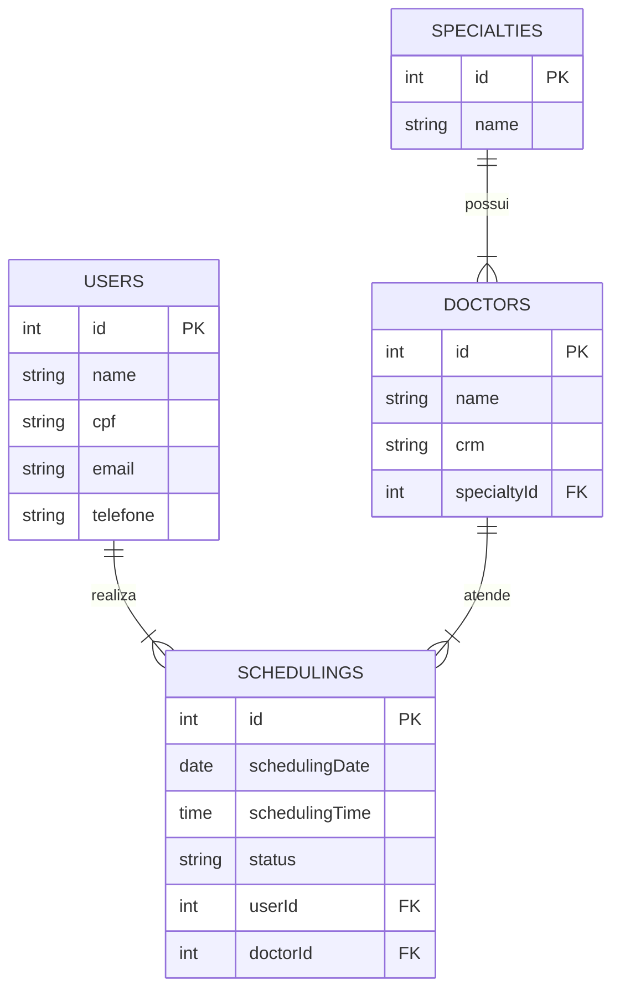

#  Sistema de Agendamento de Consultas Fictícias

## 📖 Sobre o Projeto

Este projeto foi desenvolvido como parte dos requisitos da disciplina de Desenvolvimento de Projetos de Programação Aplicados à Saúde do curso de Sistemas para Internet. Trata-se de uma aplicação web **Full-Stack** que simula um sistema de agendamento de consultas médicas, permitindo que pacientes marquem, visualizem e cancelem seus agendamentos, além de oferecer uma visão administrativa para relatórios.

O sistema foi construído seguindo a arquitetura **MVC (Model-View-Controller)** no back-end e uma arquitetura baseada em componentes no front-end.

---

## ✨ Funcionalidades Implementadas

* **Agendamento de Consulta:**
    * Cadastro implícito do paciente no primeiro agendamento (usando `findOrCreate`).
    * Seleção de especialidade e médico em menus dinâmicos.
    * Seleção de data e horário com trava visual, mostrando apenas os horários disponíveis e desabilitando os já ocupados.
* **Confirmação de Agendamento:**
    * Mensagem de sucesso na tela após a confirmação.
    * Envio de um e-mail de confirmação simulado (capturado pelo **Mailtrap**) com os detalhes da consulta.
* **Gestão de Agendamentos (Visão do Paciente):**
    * Busca de agendamentos por CPF ou e-mail.
    * Listagem de todos os agendamentos (passados e futuros).
    * Funcionalidade para o paciente cancelar agendamentos ativos.
* **Relatórios (Visão Administrativa):**
    * Geração de um relatório de todos os agendamentos para uma data específica.
    * Funcionalidade para um administrador cancelar qualquer agendamento diretamente da tela de relatório.
* **Exportação de Dados:**
    * Exportação da lista de agendamentos do dia para o formato **CSV**.
    * Geração de um **PDF** individual como comprovante para cada agendamento.

---

## 🖼️ Telas do Projeto

| Menu | Tela de Agendamento | Gestão de Consultas | Relatório Admin |

---

## 🏛️ Modelagem de Dados

A persistência de dados foi construída utilizando o **PostgreSQL** como banco de dados relacional e o **Sequelize** como ORM (Object-Relational Mapper) para a abstração e manipulação das tabelas.

A estrutura foi modelada em quatro entidades principais:

#### Tabela `users`
Armazena os dados dos pacientes. Um novo usuário é criado implicitamente no seu primeiro agendamento (`findOrCreate`).

| Coluna | Tipo | Descrição |
| :--- | :--- | :--- |
| `id` | INTEGER | Chave Primária, Auto-incremento. |
| `name` | STRING | Nome do paciente. |
| `cpf` | STRING | CPF (único). |
| `email` | STRING | E-mail (único), usado como identificador. |
| `telefone` | STRING | Telefone de contato. |

#### Tabela `specialties`
Tabela de domínio para armazenar as especialidades médicas, permitindo flexibilidade ao sistema.

| Coluna | Tipo | Descrição |
| :--- | :--- | :--- |
| `id` | INTEGER | Chave Primária, Auto-incremento. |
| `name` | STRING | Nome da especialidade (único). |

#### Tabela `doctors`
Armazena os dados dos médicos e sua relação com uma especialidade.

| Coluna | Tipo | Descrição |
| :--- | :--- | :--- |
| `id` | INTEGER | Chave Primária, Auto-incremento. |
| `name` | STRING | Nome do médico. |
| `crm` | STRING | CRM (único). |
| `specialtyId` | INTEGER | Chave Estrangeira para `specialties.id`. |

#### Tabela `schedulings`
Tabela principal que centraliza as informações do agendamento, relacionando um paciente a um médico.

| Coluna | Tipo | Descrição |
| :--- | :--- | :--- |
| `id` | INTEGER | Chave Primária, Auto-incremento. |
| `userId` | INTEGER | Chave Estrangeira para `users.id`. |
| `doctorId`| INTEGER | Chave Estrangeira para `doctors.id`. |
| `schedulingDate`| DATEONLY | Data da consulta. |
| `schedulingTime`| TIME | Hora da consulta. |
| `status` | ENUM | Status do agendamento (`agendado`, `cancelado`). |

### Diagrama de Relacionamento

---

## 🏗️ Arquitetura da Aplicação

### Back-end

   A API foi construída em Node.js com Express.js, seguindo uma arquitetura similar ao MVC:
   
    models: Contém as definições dos modelos do Sequelize, que representam as tabelas do banco de dados e suas relações.
    controllers: Camada responsável por toda a lógica de negócio. Recebe as requisições das rotas, interage com os modelos para manipular os dados e formula a resposta a ser enviada.
    routes: Define os endpoints da API. Cada arquivo de rota agrupa os endpoints de um recurso específico (ex: doctors.js, schedulings.js). Um arquivo index.js centraliza e distribui as rotas para o servidor principal, aplicando prefixos como /api/doctors.**
    server.js: Ponto de entrada da aplicação. Inicializa o Express, aplica middlewares essenciais (cors, helmet, express.json) e registra o roteador principal.

### Front-end

   A interface foi desenvolvida em React, utilizando Vite para um ambiente de desenvolvimento ágil:
  
    Estrutura: As páginas principais (ex: Agendamento, RelatorioAdmin) ficam na pasta /containers (ou /pages), enquanto componentes reutilizáveis (ex: Navbar, Footer) ficam em /components.**
    Fluxo de Dados: A comunicação com o back-end é feita através de um cliente Axios centralizado (services/api.js). As respostas da API são armazenadas no estado do componente com o hook useState, e a interface é re-renderizada de forma reativa para exibir os dados.**
    Navegação: A navegação entre páginas é gerenciada pela biblioteca React Router DOM.

---

## 🧠 Lógica e Implementações Chave

#### Algumas funcionalidades se destacam pela sua implementação:

* **Bloqueio de Horários: A "trava" de horários é implementada de forma proativa. O front-end, ao selecionar um médico e uma data, chama o endpoint GET /api/doctors/:id/availability. O back-end calcula os horários já agendados para aquele dia, subtrai da lista de horários totais e retorna apenas os horários disponíveis. No front-end, a interface renderiza todos os horários possíveis, mas desabilita visualmente (com CSS) aqueles que não estão na lista de disponíveis.**

* **Criação Implícita de Usuário: Para otimizar a experiência do usuário, não há uma etapa de "cadastro" separada. No controller de criação de agendamento (scheduling.js), o método User.findOrCreate do Sequelize é utilizado. Ele verifica se um usuário com o e-mail informado já existe; se sim, o utiliza; se não, cria um novo. Tudo isso ocorre dentro de uma transação do Sequelize para garantir a integridade dos dados: ou o usuário e o agendamento são criados com sucesso, ou nada é salvo.**

* **Geração de Documentos (CSV/PDF): A exportação é gerenciada pelo back-end. Ao receber uma requisição em uma rota de exportação, o controller:**
    * Busca os dados no banco.
    * Usa bibliotecas como json2csv ou pdfkit para formatar os dados.
    * Modifica os headers da resposta HTTP (Content-Type e Content-Disposition) para instruir o navegador a iniciar um download do arquivo em vez de tentar exibi-lo na tela.

---

## 🚀 Tecnologias Utilizadas

  Back-end: Node.js, Express, Sequelize, PostgreSQL, Nodemailer, Mailtrap, json2csv, pdfkit.
  
  Front-end: React, Vite, Axios, React Router, Tailwind CSS.
